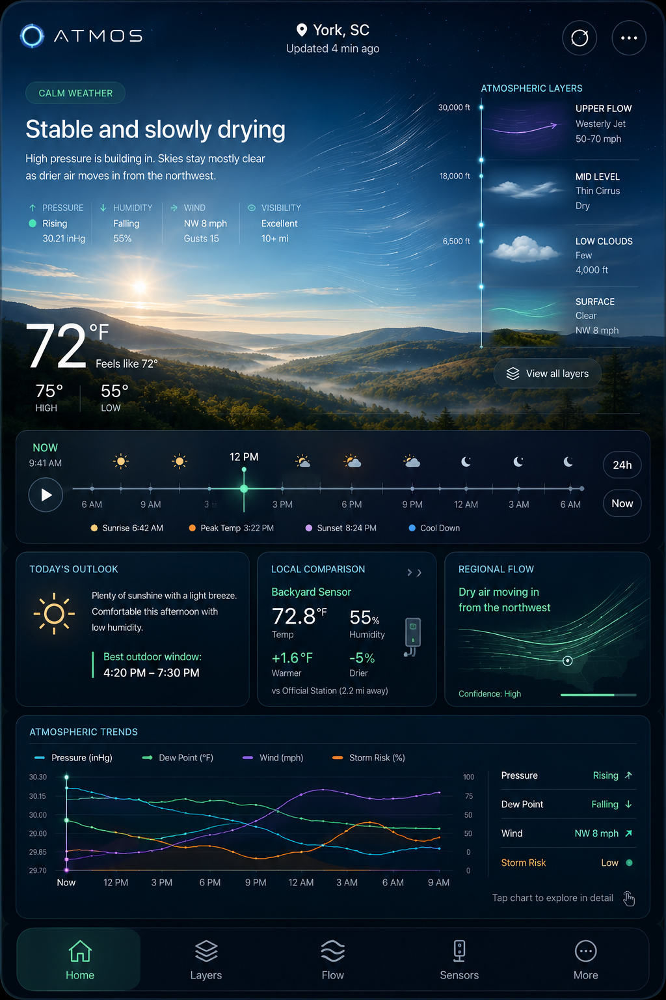
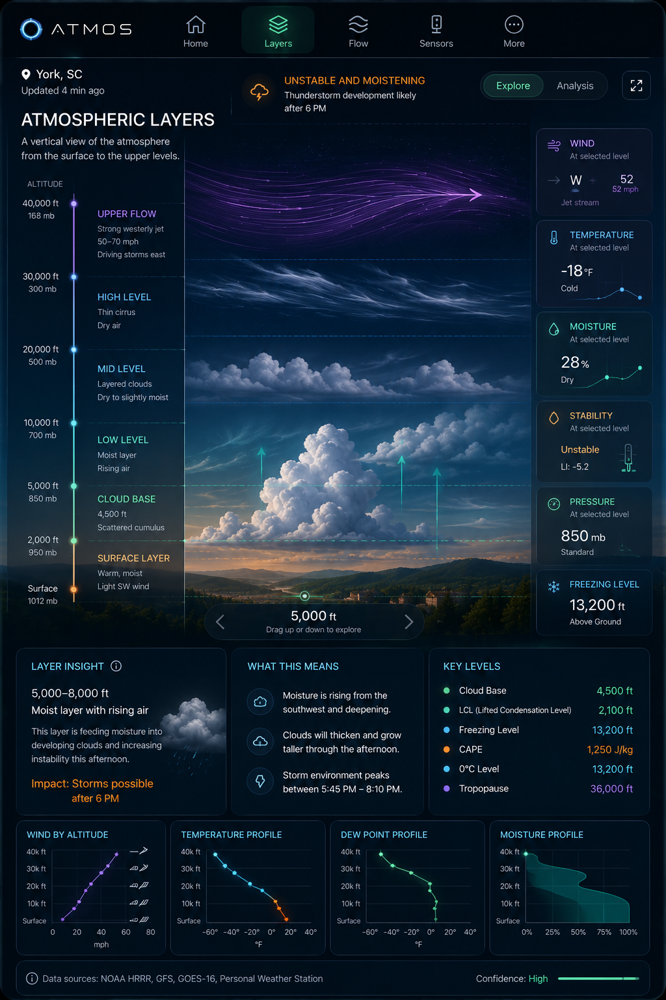
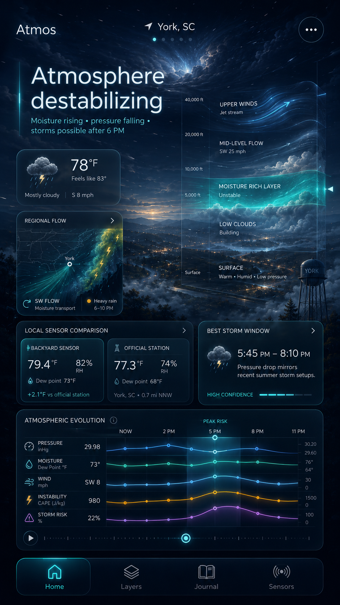
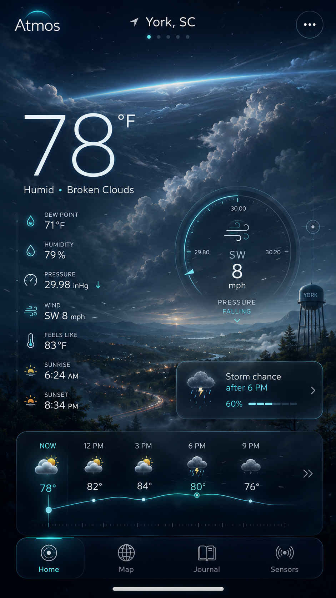

# Atmos Experience and Interaction Specification

## 1. Information architecture

Primary navigation:

1. Home
2. Layers
3. Flow
4. Sensors
5. More

Journal is deferred and must not occupy primary navigation during the MVP.

## 2. Home interaction model

### Persistent header

Contains Atmos identity, selected location, freshness indicator, location control and overflow/settings access. The freshness indicator reflects the oldest critical source contributing to the current interpretation, with details available on tap.

### Living atmospheric scene

The scene is a visual summary, not a simulated photograph. It may contain:

- time- and solar-angle-driven sky gradient
- layered terrain/horizon
- low, middle and high cloud layers
- humidity/visibility haze
- fog mask
- wind particles or streamlines
- precipitation particles
- regional inflow indicator
- optional subtle local landmark references

Scene values must map to normalized snapshot fields. Artistic interpolation is permitted; invented meteorological values are not.

### Interpretation hierarchy

1. State: “Stable and slowly drying”
2. Drivers: “High pressure is building as drier air arrives from the northwest.”
3. Timing: “Best outdoor window: 4:20–7:30 PM.”
4. Confidence and source details on expansion

### Time scrubber

The scrubber spans roughly the previous 3 hours and next 24 hours when data permits.

Required behaviors:

- horizontal drag and keyboard operation
- hourly snap points
- Now control
- play/pause
- event markers
- sunrise/sunset markers
- optional haptics on native-capable devices
- selected-time state shared across scene, text and charts
- no automatic playback in reduced-motion mode

### Intelligence drawer

Shows one prioritized insight. Expansion reveals supporting variables, confidence, timestamps, provider details and forecast disagreement when available.

### Scroll behavior

The scene occupies approximately 55–65% of the initial viewport. As the user scrolls, it compresses into a shorter header while the interpretation remains visible and trends become primary.

## 3. Home states

### Calm

Use restrained motion, strong visibility, smooth flow and light-driven depth. Calm weather should produce meaningful insights such as comfort window, drying trend, visibility or overnight cooling.

### Active development

Progressively deepen cloud layers, moisture glow and flow convergence. Avoid instantaneous “storm wallpaper.”

### Severe weather

Official warning content takes priority. Reduce decorative motion, increase contrast, show issuer, hazard, affected area, expiration and direct official safety wording or link.

### Night

Night is a separate environmental state, not a dark overlay. It accounts for moonlight, cloud opacity, cooling rate, fog risk and city glow.

### No sensor

Show the nearby official context and an unobtrusive explanation that a personal sensor can be added later.

### Stale/offline

Retain the latest cached scene while clearly showing data age. Disable or qualify interpretations that depend on freshness.

### Partial data

Hide unsupported visual layers rather than inventing values. Explain missing fields in provenance details.

## 4. Layers interaction model

### Explore mode

A vertical atmospheric column is the primary canvas. The user drags vertically or selects a labeled altitude/pressure level. The selected band highlights relevant clouds, moisture, wind and temperature. A plain-language card explains the layer’s role.

### Analysis mode

Provides compact technical profiles:

- temperature
- dew point or relative humidity
- wind speed/direction
- cloud cover/moisture
- derived freezing level
- instability values when available

Analysis mode must preserve the selected time and selected layer from Explore mode.

### Altitude and pressure

Pressure levels are authoritative data coordinates; displayed altitude is an estimate derived from geopotential height when available. The UI must not imply that a pressure level has a fixed altitude.

## 5. Flow interaction model

- pan and zoom regional map
- choose wind, pressure, moisture or precipitation layer
- scrub time with the same selected-time pattern as Home
- tap map for selected-point values
- preserve location context
- provide legend and source timestamp
- support a static-vector fallback when particle animation is disabled

## 6. Sensors interaction model

- list view with health summary
- detail view with current readings and history
- comparison against official station/model estimate
- calibration state
- battery/connectivity freshness
- sensor placement metadata
- simulated adapter clearly labeled in development/demo mode

## 7. Motion language

Motion communicates direction, intensity, transition and depth. It must not be constant visual noise.

- calm wind: slow continuous traces
- gusts: brief speed and density increase
- moisture: broad low-frequency drift
- pressure boundary: slow directional sweep
- precipitation: density tied to rate category
- lightning: only with verified signal and accessibility-safe flash limits
- transitions: 250–600 ms for UI; environmental interpolation may be longer

## 8. Accessibility

- WCAG 2.2 AA contrast targets
- full keyboard interaction
- screen-reader equivalent for all graphics
- reduced-motion mode
- no information conveyed by color alone
- large touch targets, minimum 44×44 CSS pixels
- meaningful focus order
- chart summaries and data tables available to assistive technology
- warnings remain understandable without visual effects

## 9. Visual references

### Approved Home direction

Use for mood, hierarchy, layered scene, calm-state proof and progressive disclosure. Do not copy the exact number of cards or desktop-like density onto a phone.

### Approved Layers direction

Use for vertical exploration, Explore/Analysis split and the relationship between atmospheric artwork and technical profiles.

### Earlier direction — atmospheric situation

Useful for the interpretive headline and multi-variable evolution concept. Superseded in density and permanent card layout.

### Superseded visual study

Retained only as visual history. It is too close to a conventional weather dashboard and must not guide product hierarchy.
